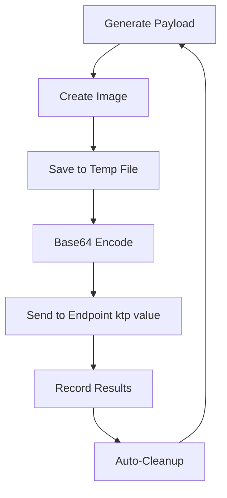

```mermaid
graph TD
  A[Generate Payload] --> B[Create Image]
  B --> C[Save to Temp File]
  C --> D[Base64 Encode]
  D --> E[Send to Endpoint ktp value]
  E --> F[Record Results]
  F --> G[Auto-Cleanup]
  G --> A
```
