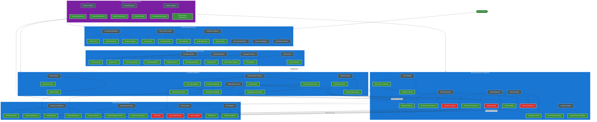

```mermaid
flowchart TD
    Start([Start Investigation]) --> DataCollection[Data Collection Phase]
    
    %% ================= DATA COLLECTION =================
    subgraph DataCollection[Data Collection & Sources]
        direction TB
        A1[Social Media Monitoring]
        A2[Public Records Search]
        A3[News & Media Analysis]
        A4[Corporate Intelligence]
        A5[Dark Web Surveillance]
        A6[Geospatial Intelligence]
        
        A1 --> A11[Twitter/X APIs]
        A1 --> A12[LinkedIn/Facebook]
        A1 --> A13[Telegram Channels]
        
        A2 --> A21[Court Records]
        A2 --> A22[Property Records]
        A2 --> A23[Voter Databases]
        
        A6 --> A61[Google Maps Data]
        A6 --> A62[Satellite Imagery]
    end
    
    DataCollection --> DataPreprocessing
    
    %% ================= PREPROCESSING =================
    subgraph DataPreprocessing[Data Preprocessing & Cleaning]
        direction TB
        B1[Raw Data Extraction]
        B2[Data Standardization]
        B3[Language Processing]
        B4[Quality Control]
        
        B1 --> B11[OCR Processing]
        B1 --> B12[Speech-to-Text]
        B1 --> B13[Web Content Parsing]
        
        B2 --> B21[Format Normalization]
        B2 --> B22[Duplicate Removal]
        
        B3 --> B31[Multi-language Support]
        B3 --> B32[Slang Detection]
        B3 --> B33[Name Variants Mapping]
        
        B4 --> B41[Data Validation]
        B4 --> B42[Source Verification]
    end
    
    DataPreprocessing --> CoreAnalysis
    
    %% ================= CORE ANALYSIS =================
    subgraph CoreAnalysis[Core Name Intelligence]
        direction TB
        C1[Identity Resolution Engine]
        C2[Relationship Discovery]
        C3[Temporal Analysis]
        C4[Context Analysis]
        
        C1 --> C11[Exact Name Matching]
        C1 --> C12[Fuzzy Logic Matching]
        C1 --> C13[AI-Powered Entity Linking]
        C1 --> C14[Alias Detection]
        
        C2 --> C21[Social Network Mapping]
        C2 --> C22[Organizational Connections]
        C2 --> C23[Communication Patterns]
        
        C3 --> C31[Timeline Construction]
        C3 --> C32[Activity Pattern Analysis]
        
        C4 --> C41[Behavioral Context]
        C4 --> C42[Location Context]
    end
    
    CoreAnalysis --> AdvancedAnalytics
    
    %% ================= ADVANCED ANALYTICS =================
    subgraph AdvancedAnalytics[Advanced Analytics & Intelligence]
        direction TB
        D1[Pattern Recognition]
        D2[Anomaly Detection]
        D3[Cross-Validation]
        D4[Risk Assessment]
        D5[Predictive Analysis]
        
        D1 --> D11[Behavioral Patterns]
        D1 --> D12[Communication Frequency]
        D1 --> D13[Location Mobility]
        
        D2 --> D21[Identity Spoofing]
        D2 --> D22[Suspicious Activities]
        D2 --> D23[Data Inconsistencies]
        
        D3 --> D31[Multi-Source Verification]
        D3 --> D32[Confidence Scoring]
        
        D4 --> D41[Threat Level Assessment]
        D4 --> D42[Reputation Scoring]
        
        D5 --> D51[Future Activity Prediction]
        D5 --> D52[Network Evolution Modeling]
    end
    
    AdvancedAnalytics --> OutputGeneration
    
    %% ================= OUTPUT & VISUALIZATION =================
    subgraph OutputGeneration[Intelligence Output & Reporting]
        direction TB
        E1[Interactive Visualizations]
        E2[Comprehensive Reports]
        E3[Real-time Alerts]
        E4[API Integration]
        
        E1 --> E11[3D Network Graphs]
        E1 --> E12[Timeline Visualizations]
        E1 --> E13[Geospatial Maps]
        E1 --> E14[Relationship Matrices]
        
        E2 --> E21[Executive Summary]
        E2 --> E22[Detailed Intelligence Report]
        E2 --> E23[Evidence Documentation]
        
        E3 --> E31[Threat Alerts]
        E3 --> E32[New Identity Detection]
        E3 --> E33[Pattern Changes]
        
        E4 --> E41[RESTful APIs]
        E4 --> E42[Database Integration]
    end
    
    OutputGeneration --> FeedbackLoop
    
    %% ================= FEEDBACK & CONTINUOUS IMPROVEMENT =================
    subgraph FeedbackLoop[Continuous Learning & Improvement]
        direction TB
        F1[Analyst Feedback]
        F2[Model Refinement]
        F3[Database Updates]
        
        F1 --> F11[Accuracy Assessment]
        F1 --> F12[False Positive Review]
        
        F2 --> F21[Algorithm Optimization]
        F2 --> F22[AI Model Training]
        
        F3 --> F31[Knowledge Base Update]
        F3 --> F32[Pattern Library Enhancement]
    end
    
    %% ================= LOGICAL CONNECTIONS =================
    
    %% Core Analysis Internal Logic
    C11 --> C21
    C12 --> C21
    C13 --> C21
    C14 --> C22
    C31 --> C32
    C41 --> C42
    
    %% Advanced Analytics Dependencies
    C21 --> D11
    C22 --> D11
    C31 --> D12
    C32 --> D13
    C13 --> D21
    C14 --> D22
    
    %% Cross-validation flows
    D31 --> D32
    D32 --> D41
    D41 --> D42
    
    %% Output Dependencies
    D11 --> E11
    D12 --> E12
    C42 --> E13
    C21 --> E14
    D41 --> E21
    D22 --> E31
    C14 --> E32
    D13 --> E33
    
    %% Feedback Loops
    FeedbackLoop --> DataCollection
    FeedbackLoop --> CoreAnalysis
    FeedbackLoop --> AdvancedAnalytics
    
    %% Emergency/Alert Paths
    D22 -.->|High Priority Alert| E31
    D21 -.->|Immediate Notification| E32
    
    %% Data Quality Assurance
    B42 -.->|Quality Check| C1
    D32 -.->|Confidence Validation| E2
    
    %% Styling dengan kontras yang baik
    classDef startNode fill:#2e7d32,stroke:#ffffff,stroke-width:3px,color:#ffffff
    classDef processNode fill:#1976d2,stroke:#ffffff,stroke-width:2px,color:#ffffff
    classDef dataNode fill:#388e3c,stroke:#ffffff,stroke-width:2px,color:#ffffff
    classDef alertNode fill:#d32f2f,stroke:#ffffff,stroke-width:2px,color:#ffffff
    classDef feedbackNode fill:#7b1fa2,stroke:#ffffff,stroke-width:2px,color:#ffffff
    classDef subprocessNode fill:#455a64,stroke:#ffffff,stroke-width:1px,color:#ffffff
    
    class Start startNode
    class DataCollection,DataPreprocessing,CoreAnalysis,AdvancedAnalytics,OutputGeneration processNode
    class A1,A2,A3,A4,A5,A6,B1,B2,B3,B4,C1,C2,C3,C4,D1,D2,D3,D4,D5,E1,E2,E3,E4,F1,F2,F3 subprocessNode
    class A11,A12,A13,A21,A22,A23,A61,A62,B11,B12,B13,B21,B22,B31,B32,B33,B41,B42 dataNode
    class C11,C12,C13,C14,C21,C22,C23,C31,C32,C41,C42,D11,D12,D13,D21,D22,D23,D31,D32,D41,D42,D51,D52 dataNode
    class E11,E12,E13,E14,E21,E22,E23,E31,E32,E33,E41,E42,F11,F12,F21,F22,F31,F32 dataNode
    class E31,E32,E33,D21,D22,D23 alertNode
    class FeedbackLoop feedbackNode
```
